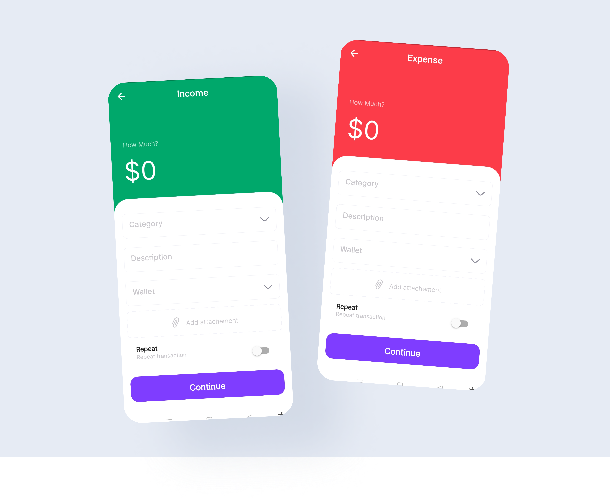

# Uang Track

Uang Track is an application that is used to record daily financial expenses and income. This application is a personal project of Ryumimo A.K.A Ilham Suherman.

## Screenshot
### Login Page

### Dashboard

### Record Page

## Future Features

* Register, login, with email ✅
* SignIn With Google Account ✅
* Add, edit, and delete transaction data✅
* Add, edit, and delete category data✅
* Add, edit, and delete account data✅
* Add, edit, and delete budget data
* Add, edit, and delete reminder data
* Add, edit, and delete debt data